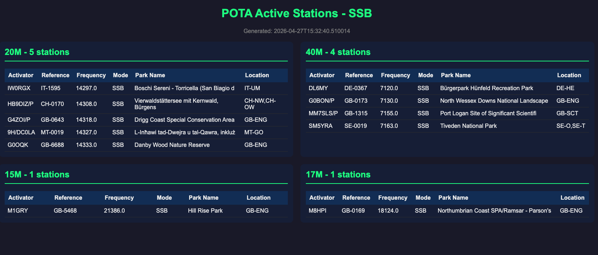

# POTA Active Stations

Dashboard que muestra las estaciones POTA activas en las bandas de 20m, 40m, 15m y 17m en modo SSB.



## Funcionamiento

1. El script `fetch_pota.py` consulta `https://api.pota.app/v1/spots`, el mismo endpoint que consume el frontend oficial [next.pota.app](https://next.pota.app/).
2. Filtra, deduplica y ordena las estaciones en memoria.
3. Genera `pota_active_stations.html` de forma atómica (archivo temporal + `rename`), así que nunca queda un HTML truncado servido si el proceso falla a mitad.
4. `run_fetch.sh` copia el resultado al web root.

Ese endpoint **ignora todos los query params** (`?band=`, `?mode=`, `?limit=` devuelven siempre la misma respuesta), por eso el filtrado es del lado del script.

## Filtros aplicados

- **Bandas**: 20m (14.000-14.350 kHz), 40m (7.000-7.300 kHz), 15m (21.000-21.450 kHz), 17m (18.068-18.168 kHz)
- **Modo**: Solo SSB (`MODES` en `fetch_pota.py`)
- **Referencia**: Se excluyen referencias que empiezan con `US-` (estaciones desde USA)

Los limites de banda salen del band plan de la app oficial. 40m va hasta 7.300 kHz (no 7.200) para no perder SSB de DX en el tope de la banda.

## Instalacion

No hace falta instalar nada: el script solo usa la libreria estandar y `curl`.

```bash
git clone https://github.com/USUARIO/pota-active-stations.git
cd pota-active-stations
```

## Uso

```bash
# Ejecutar manualmente
python3 fetch_pota.py

# O usar el script bash (ademas publica en /var/www/html)
./run_fetch.sh

# Destino de publicacion configurable
PUBLISH_DIR=/ruta/salida ./run_fetch.sh
```

Esto genera el archivo `pota_active_stations.html` que podés abrir en tu navegador.

El script devuelve `0` si pudo actualizar el dashboard y `1` si fallo, para que cron lo detecte. Ante un fallo de red reintenta 3 veces y, si tampoco funciona, **deja el HTML anterior intacto** en vez de publicarlo vacio.

## Ejecucion automatica con cron

En el servidor el job corre cada 4 minutos. Adaptar el intervalo al tuyo:

```bash
crontab -e

*/4 * * * * /ruta/a/pota-active-stations/run_fetch.sh >> /ruta/a/pota-active-stations/run.log 2>&1
```

El script no depende del directorio de trabajo: resuelve las rutas a partir de su propia ubicacion, asi que funciona igual desde cron.

## Publicacion

- `pota_active_stations.html` - Dashboard con las estaciones activas
- `PUBLISH_DIR` - donde copia `run_fetch.sh` (default `/var/www/html`); si no es escribible avisa y sale con `0` sin fallar

## Desarrollo

```bash
ruff check .          # lint (config en ruff.toml)
ruff format --check .
```

## Dependencias

- Python 3.9+ (usa anotaciones con `from __future__ import annotations`, asi que 3.9 es suficiente)
- `curl` (incluido en macOS/Linux)
